

  <h1>Day - 6 of CEH</h1>

## Part -2 : Footprinting & Reconnaissance
---

## 1. Metadata

### Definition
Metadata is data about data. It contains hidden information embedded inside:
- Images  
- PDFs  
- Word documents  
- Websites  

  

### Metadata Can Contain
- File creation date  
- Last modified date  
- Author name  
- Software used  
- GPS location (Images)  
- Camera or device details  

### Risk
Improperly removed metadata can leak sensitive organizational or personal information.

---

## 2. ExifTool (Metadata Extraction)

### Tool Description
ExifTool is a command-line utility used to:
- Read metadata  
- Write metadata  
- Edit metadata  

### Command (Parrot OS)
exiftool <filename>

### Practical Steps
1. Download an image from a browser (Firefox preferred)  
2. Upload the image to gofile.io  
3. Copy the download link  
4. Download the image again  
5. Run ExifTool on the image  

  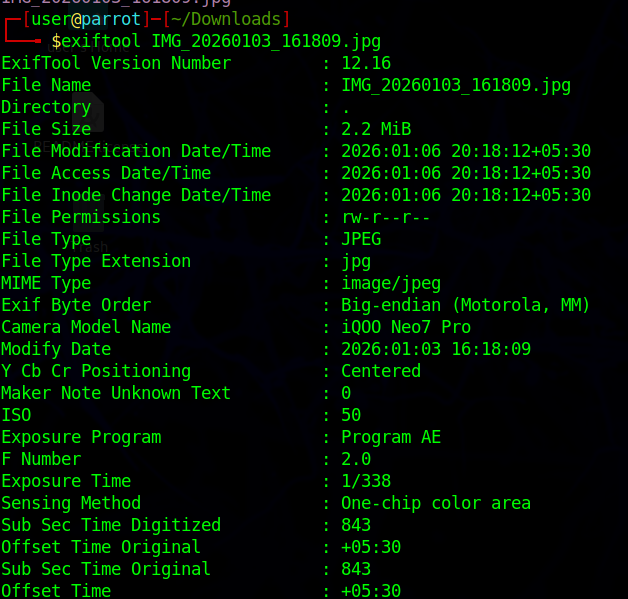

  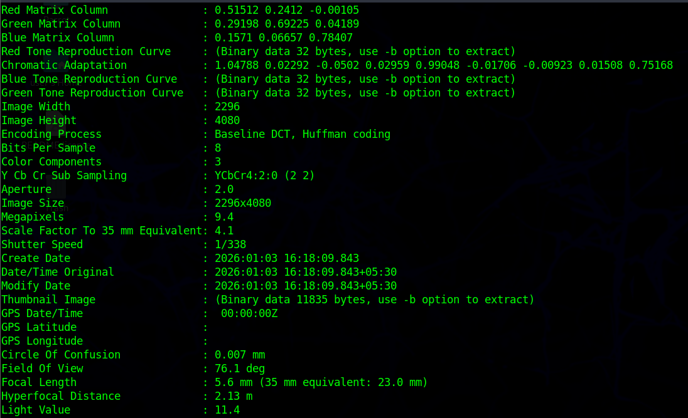

### Information Extracted
- Camera model  
- Date and time  
- GPS coordinates  
- Image resolution  

---

## 3. Online Metadata Removal Tool

### Tool
metadata2go

### Purpose
- Removes unnecessary metadata  
- Protects user privacy  
- Reduces sensitive information leakage  

  

### Observation
After using metadata2go, the metadata extracted using ExifTool is significantly reduced.

---

## 4. Metagoofil

### Tool Description
Metagoofil extracts metadata from publicly available documents such as:
- PDF  
- DOCX  
- PPT  
- XLS  

### Installation
sudo apt install metagoofil

  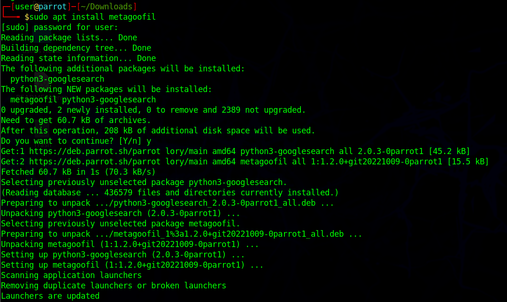

### Fix Broken Packages (If Required)
sudo apt --fix-broken install

### Help Menu
sudo metagoofil --help

  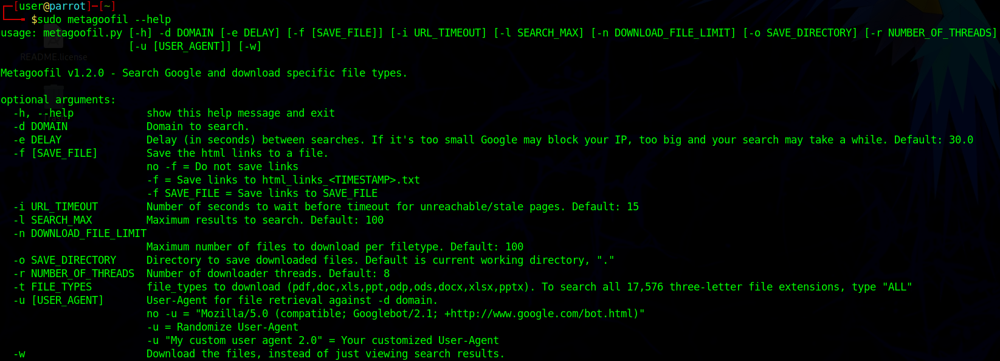

### Information Gathered
- Usernames  
- Email IDs  
- File paths  
- Software versions  

## Implementation
sudo metagoofil -d <website name > -l <no. of search> -n <no.od download> -t <types of a file> -w

  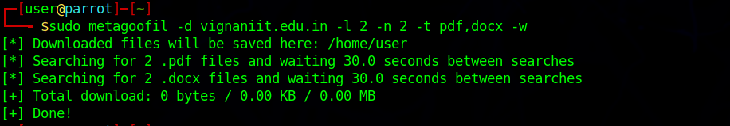

---

## 5. TheHarvester

### Tool Description
TheHarvester collects publicly available information such as:
- Email addresses  
- Subdomains  
- Hosts  
- Employee names  

### Command
sudo theHarvester -d <domain name> -b <source name>

  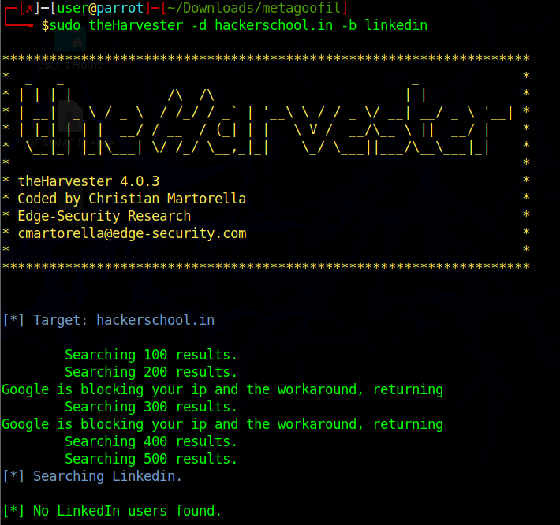

### Data Sources
- Google  
- LinkedIn  
- Bing  
- Yahoo  
 
---

## 6. Web Camera Search Engines

### Examples
- webcamxp.com  
- iplivecam.com 
- Insecam 

  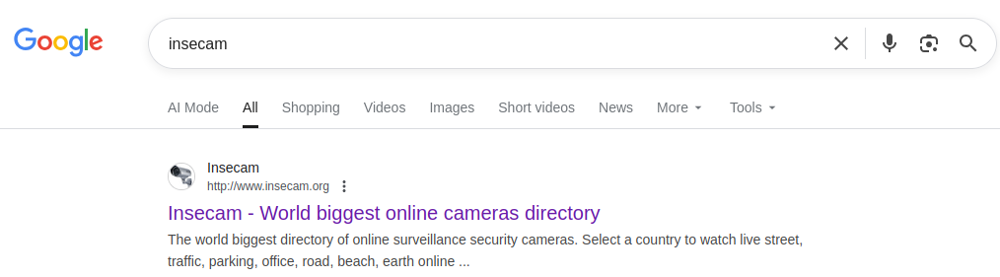

### Purpose
- Demonstrates how attackers discover unsecured cameras  
- Highlights real-world IoT security risks  

  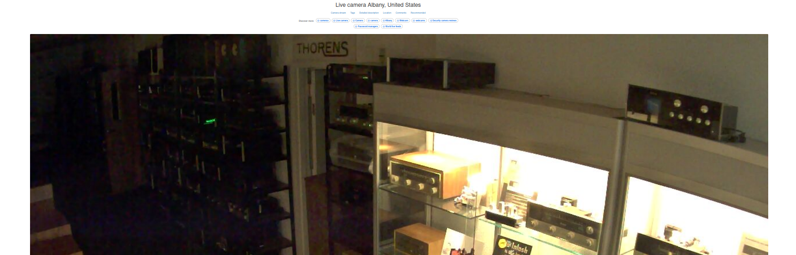

  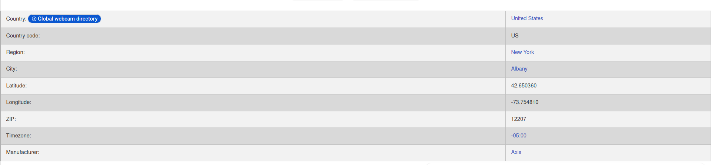

  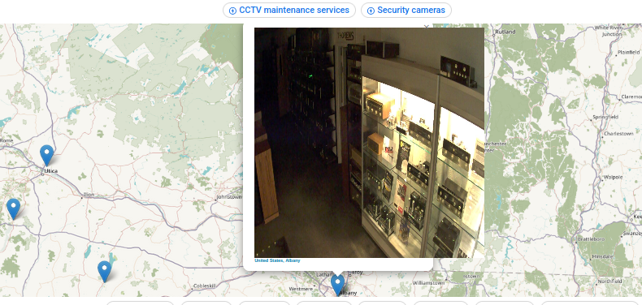

### Important Note
Unauthorized access is illegal.  
Use only for educational and awareness purposes.

---

## 7. Shodan

### Website
https://www.shodan.io

### What is Shodan?
Shodan is a search engine for Internet-connected devices.  
It indexes:
- Servers  
- Routers  
- Webcams  
- IoT devices  
- Industrial systems (ICS/SCADA)  

---

## 7.1 Accessing Shodan
1. Open any browser  
2. Search for Shodan  
3. Click shodan.io  
4. Create an account  
5. Verify email  by using temp mail
6. Login  

  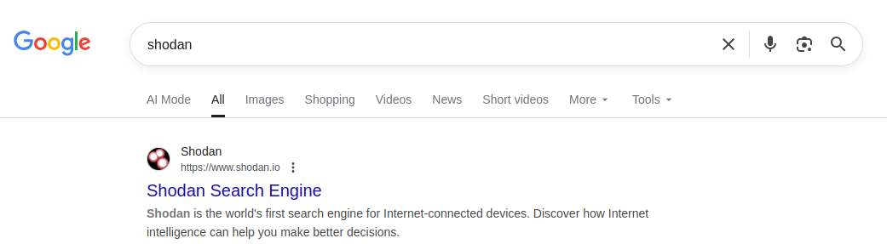

  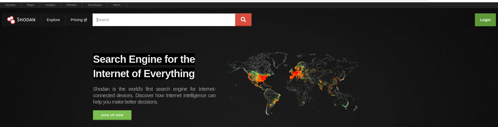

---

## 8.2 Advanced Shodan Filters 
country:IN  
port:22  
org:BSNL  
os:Windows  
product:Apache  

Example:  
webcam country:IN

  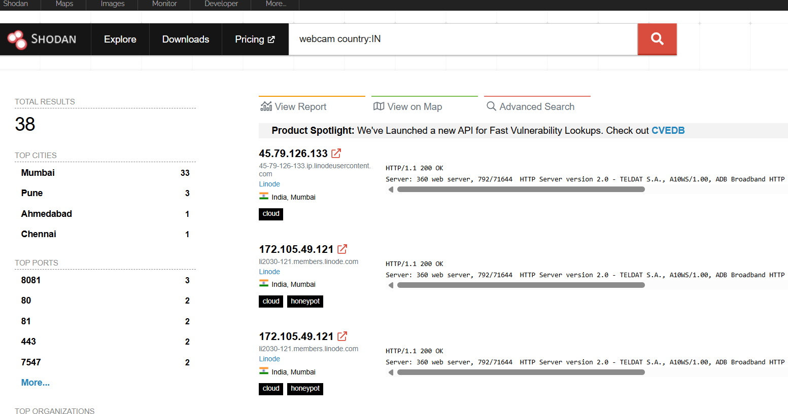

  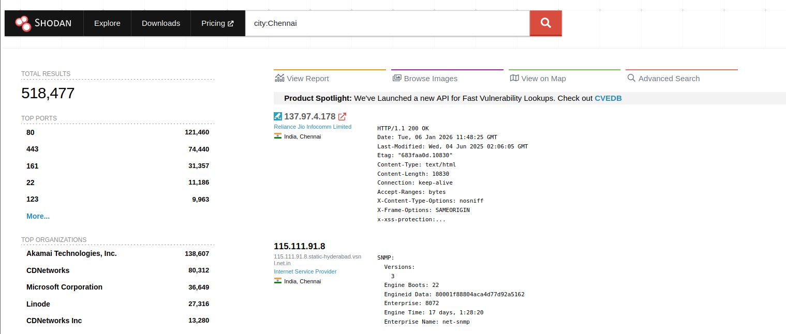

---

## 8.3 Information Extracted
- IP address  
- Open ports  
- Running services  
- Service banners  
- Organization name  
- Approximate location 

  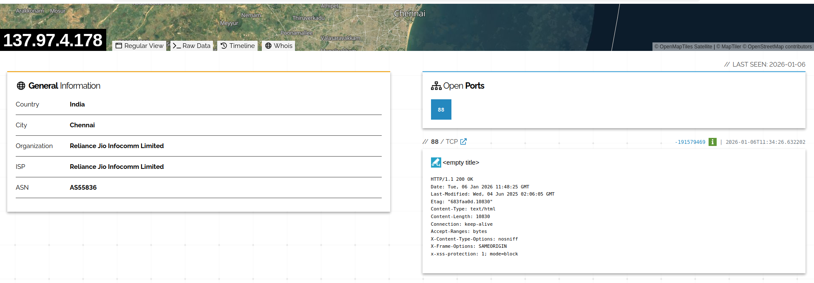

  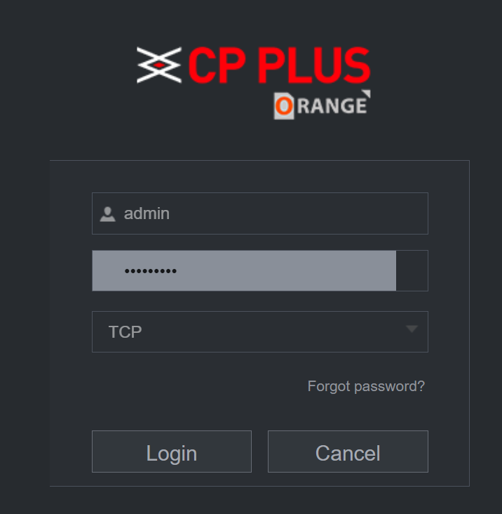

  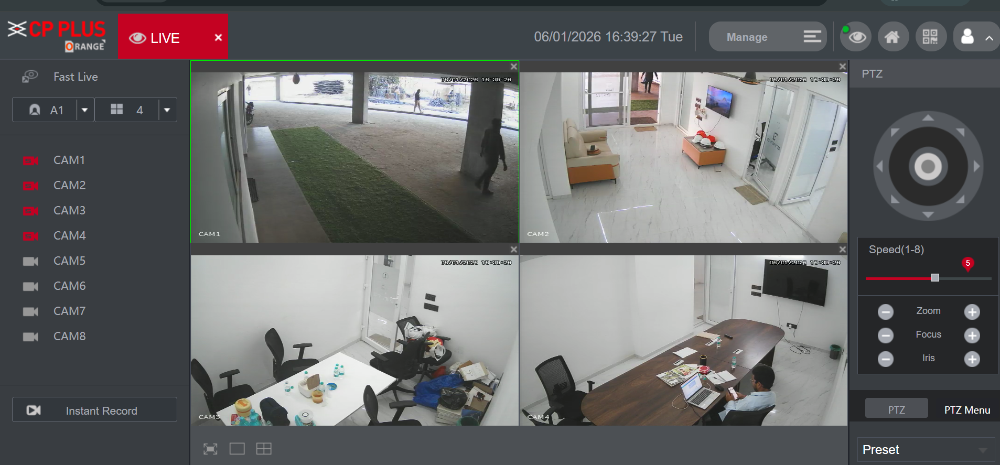

---
## Conclusion

In this session, we studied **metadata**, using tools like **ExifTool**, **Metagoofil**, **TheHarvester**, and exploring **Shodan** and web camera search engines, we understood how sensitive information can be exposed through publicly available sources. This lab highlights the importance of proper data handling, strong security configurations, and awareness of information leakage to protect systems from potential attacks.

---

